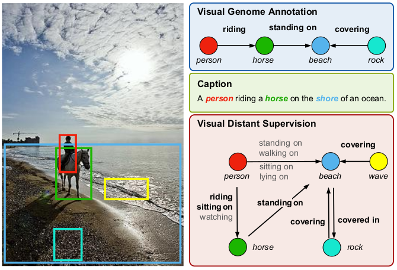

# Distant Supervision for Scene Graph Generation

Data and code for ICCV 2021 paper [Distant Supervision for Scene Graph Generation](https://arxiv.org/abs/2103.15365).

## Introduction
The paper applies distant supervision to visual relation detection. The intuition of distant supervision is that possible predicates between  entity pairs are highly dependent on the entity types. For example, there might be `ride on`, `feed` between human and horse in images, but it is less likely to be  `covering`.  Thus, we apply this correlation to take advantage of unlabeled data. Given the knowledge base containing possible combinations between entity types and predicates, our framework enables *distantly supervised* training without using any human-annotated relation data, and *semi-supervised* training that incorporates both human-labeled data and distantly labeled data. To build the knowledge base, we parse all possible (subject, predicate, object) triplets from Conceptual Caption dataset, resulting in a knowledge base containing 1.9M distinct relational triples. 

### Code
Thanks to the elegant code from [Scene-Graph-Benchmark.pytorch](https://github.com/KaihuaTang/Scene-Graph-Benchmark.pytorch). This project is built on their framework. There are also some differences from their settings. We show the differences in a [later section](#difference-from-scene-graph-benchmarkpytorch).

### The Illustration of Distant Supervision


## Installation

Check [INSTALL.md](INSTALL.md) for installation instructions.

## Dataset

Check [DATASET.md](DATASET.md) for instructions of dataset preprocessing.

## KB

The corresponding KB for 20 and 50 predicate classes can be found in the  [DATASET.md](DATASET.md). We also provide the [raw KB](https://thunlp.oss-cn-qingdao.aliyuncs.com/CC_allobjs_4000rels.json) without alignment to pre-defined relations.   The data format will looks like:

```python
{
    "subject_object": [rel1, rel2, rel3...],
}
```


## Metrics
Our metrics are directly adapted from [Scene-Graph-Benchmark.pytorch](https://github.com/KaihuaTang/Scene-Graph-Benchmark.pytorch).

## Object Detector

### Download Pre-trained Detector

In generally SGG tasks, the detector is pre-trained on the object bounding box annotations on training set. We directly use the [pre-trained Faster R-CNN](https://onedrive.live.com/embed?cid=22376FFAD72C4B64&resid=22376FFAD72C4B64%21779870&authkey=AH5CPVb9g5E67iQ) provided by [Scene-Graph-Benchmark.pytorch](https://github.com/KaihuaTang/Scene-Graph-Benchmark.pytorch), because our 20 category setting and their 50 category setting have the same training set.

After you download the [Faster R-CNN model](https://onedrive.live.com/embed?cid=22376FFAD72C4B64&resid=22376FFAD72C4B64%21779870&authkey=AH5CPVb9g5E67iQ), please extract all the files to the directory `/home/username/checkpoints/pretrained_faster_rcnn`. To train your own Faster R-CNN model, please follow the next section.

The above pre-trained Faster R-CNN model achives 38.52/26.35/28.14 mAp on VG train/val/test set respectively.

### Pre-train Your Own Detector

In this work, we do not modify the Faster R-CNN part. The training process can be referred to the [origin code](https://github.com/KaihuaTang/Scene-Graph-Benchmark.pytorch/blob/master/README.md).

## EM Algorithm based Training

All commands of training are saved in the directory `cmds/`. The directory of `cmds` looks like:

```python
cmds/  
├── 20 
│   └── motif
│       ├── predcls
│       │   ├── ds \\ distant supervision which is weakly supervised training
│       │   │   ├── em_M_step1.sh
│       │   │   ├── em_E_step2.sh
│       │   │   ├── em_M_step2.sh
│       │   │   ├── em_M_step1_wclip.sh
│       │   │   ├── em_E_step2_wclip.sh
│       │   │   └── em_M_step2_wclip.sh
│       │   ├── semi \\ semi-supervised training 
│       │   │   ├── em_E_step1.sh
│       │   │   ├── em_M_step1.sh
│       │   │   ├── em_E_step2.sh
│       │   │   └── em_M_step2.sh
│       │   └── sup
│       │       ├── train.sh
│       │       └── val.sh
│       │
│       ├── sgcls
│       │   ...
│       │
│       ├── sgdet
│       │   ...

```

Generally, we use an EM algorithm based training, which means the model is trained iteratively. In E-step, we estimate the predicate label distribution between entity pairs. In M-step, we optimize the model with estimated predicate label distribution. For example, the em_E_step1 means the initialization of predicate label distribution, and in em_M_step1 the model will be optimized on the label estimation.

All checkpoints can be downloaded from [MODEL_ZOO.md](MODEL_ZOO.md).

## Preparation

Before running the code, you need to specify the current path as environment variable `SG` and the experiments' root directory as `EXP`.

```sh
# specify current directory as SG, e.g.:
export SG=~/VisualDS
# specify experiment directory, e.g.:
export EXP=~/exps
```


### Weakly Supervised Training

Weakly supervised training can be done with only knowledge base or can also use external semantic signals to train a better model. As for the external semantic signals, we use currently popular [CLIP](https://github.com/openai/CLIP) to initialize the probability of possible predicates between entity pairs.  

1. w/o CLIP training for Predcls:

```sh
# no need for em_E_step1
sh cmds/20/motif/predcls/ds/em_M_step1.sh
sh cmds/20/motif/predcls/ds/em_E_step2.sh
sh cmds/20/motif/predcls/ds/em_M_step2.sh
```

2. with CLIP training for Predcls:

Before training, please ensure `datasets/vg/20/cc_clip_logits.pk` is downloaded.  

```sh
# the em_E_step1 is conducted by CLIP
sh cmds/20/motif/predcls/ds/em_M_step1_wclip.sh
sh cmds/20/motif/predcls/ds/em_E_step2_wclip.sh
sh cmds/20/motif/predcls/ds/em_M_step2_wclip.sh
```

3. training for Sgcls and Sgdet:

E_step results of Predcls are directly used for Sgcls and Sgdet. Thus, there is no `em_E_step.sh` for Sgcls and Sgdet.


### Semi-Supervised Training

In semi-supervised training, we use supervised model trained with labeled data to estimate predicate labels for entity pairs. So before conduct semi-supervised training, we should conduct a normal supervised training on Predcls task first:

```sh
sh cmds/20/motif/predcls/sup/train.sh
```

Or just download the trained model [here](https://thunlp.oss-cn-qingdao.aliyuncs.com/predcls-sup-sup.tar.gz), and put it into `$EXP/20/predcls/sup/sup`.

Noted that, for three tasks `Predcls, Sgcls, Sgdet`, we all use supervised model of `Predcls` task to initialize predicate label distributions. After the preparation, we can run:

```sh
sh cmds/20/motif/predcls/semi/em_E_step1.sh
sh cmds/20/motif/predcls/semi/em_M_step1.sh
sh cmds/20/motif/predcls/semi/em_E_step2.sh
sh cmds/20/motif/predcls/semi/em_M_step2.sh
```

## Difference from Scene-Graph-Benchmark.pytorch

1. Fix a bug in evaluation.

   We found that in previous evaluation, there are sometimes duplicated triplets in images, e.g. `(1-man, ride, 2-horse)*3`. We fix this small bug and use only unique triplets.  By fixing the bug, the performance of the model will decrease somewhat. For example, the R@100 of predcls task will decrease about 1~3 points. 

2. We conduct experiments on 20 categories predicate setting rather than 50 categories.

3. In evaluation, weakly supervised trained model uses **logits** rather than **softmax normalized scores** for relation triplets ranking. 
